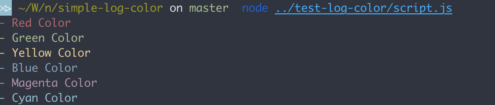

# Simple Log Color

It is a Node.js module for colorizing console log output.

## Install

```bash
npm i simple-log-color --save
```

## Usage

Crete constant form module:

```bash
const color = require('simple-log-color')
```

Use:

```bash
console.log(color.Red, "Red Color")
console.log(color.Green, "Green Color")
console.log(color.Yellow, "Yellow Color")
console.log(color.Blue, "Blue Color")
console.log(color.Magenta, "Magenta Color")
console.log(color.Cyan, "Cyan Color")
```

## Output

